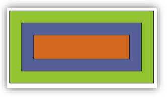
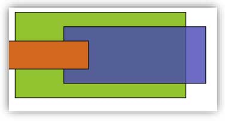

# Exercices de formation IFA (HTML et CSS)

*Sur GitHub cliquez sur le titre de l'exercice, HTML ou CSS pour voir le code lié à chaque exercice.*

*Vous pouvez également cloner ou télécharger le repositorie, ouvir le fichier "index.html" afin de naviguer entre les différents exercices.*

*Sur la page "index.html", cliquez sur le titre pour accéder à l'exercice.*

## 1) [JCVD Patrick Sébastien](https://github.com/cedric-famibelle/html_css/tree/master/1-jcvd_patrick_sebastien) -> [HTML](https://github.com/cedric-famibelle/html_css/blob/master/1-jcvd_patrick_sebastien/index.html) -> [CSS](https://github.com/cedric-famibelle/html_css/blob/master/1-jcvd_patrick_sebastien/script/style.css)

### Reproduire la page.

## 2) [Faire un squelette HTML5](https://github.com/cedric-famibelle/html_css/tree/master/2-squelette_html) -> [HTML](https://github.com/cedric-famibelle/html_css/blob/master/2-squelette_html/index.html)

### Reproduire le squelette HTML du document en HTML5.

## 3) [Créer un CV à l'aide des balises sémantiques](https://github.com/cedric-famibelle/html_css/tree/master/3-cv_html) -> [HTML](https://github.com/cedric-famibelle/html_css/blob/master/3-cv_html/cv.html) -> [CSS](https://github.com/cedric-famibelle/html_css/blob/master/3-cv_html/script/style.css)

## 4) [Positionnement : Reproduire les images](https://github.com/cedric-famibelle/html_css/tree/master/4-positionnement) 

### 1 - [No Position](https://github.com/cedric-famibelle/html_css/tree/master/4-positionnement/1-no_position) -> [HTML](https://github.com/cedric-famibelle/html_css/blob/master/4-positionnement/1-no_position/no_position.html) -> [CSS](https://github.com/cedric-famibelle/html_css/blob/master/4-positionnement/1-no_position/style.css)

### 2 - [Relative (utiliser position relative)](https://github.com/cedric-famibelle/html_css/tree/master/4-positionnement/2-relative) -> [HTML](https://github.com/cedric-famibelle/html_css/blob/master/4-positionnement/2-relative/relative.html) -> [CSS](https://github.com/cedric-famibelle/html_css/blob/master/4-positionnement/2-relative/style.css)

### 3 - [Absolute (utiliser position absolute)](https://github.com/cedric-famibelle/html_css/tree/master/4-positionnement/3-absolute) -> [HTML](https://github.com/cedric-famibelle/html_css/blob/master/4-positionnement/3-absolute/absolute.html) -> [CSS](https://github.com/cedric-famibelle/html_css/blob/master/4-positionnement/3-absolute/style.css)

### 4 - [Absolute 2 (utiliser position absolute)](https://github.com/cedric-famibelle/html_css/tree/master/4-positionnement/4-absolute_2) -> [HTML](https://github.com/cedric-famibelle/html_css/blob/master/4-positionnement/4-absolute_2/absolute_2.html) -> [CSS](https://github.com/cedric-famibelle/html_css/blob/master/4-positionnement/4-absolute_2/style.css)

### 5 - [Absolute 3 (Box Sizing) (Position absolute)](https://github.com/cedric-famibelle/html_css/tree/master/4-positionnement/5-absolute_3_box_size) -> [HTML](https://github.com/cedric-famibelle/html_css/blob/master/4-positionnement/5-absolute_3_box_size/absolute_3_box_size.html) -> [CSS](https://github.com/cedric-famibelle/html_css/blob/master/4-positionnement/5-absolute_3_box_size/style.css)

### 5 - [Relative (Box Sizing) (Position relative)](https://github.com/cedric-famibelle/html_css/tree/master/4-positionnement/5-relative_box_size) -> [HTML](https://github.com/cedric-famibelle/html_css/blob/master/4-positionnement/5-relative_box_size/relative_box_size.html) -> [CSS](https://github.com/cedric-famibelle/html_css/blob/master/4-positionnement/5-relative_box_size/style.css)

### 6 - [Z_index : Le flux doit respecter l’ordre suivant : vert, bleu, chocolat, jaune](https://github.com/cedric-famibelle/html_css/tree/master/4-positionnement/6-z_index) -> [HTML](https://github.com/cedric-famibelle/html_css/blob/master/4-positionnement/6-z_index/z_index.html) -> [CSS](https://github.com/cedric-famibelle/html_css/blob/master/4-positionnement/6-z_index/style.css)

### 7 - [Float : Utiliser les propriétés float pour réaliser ce dessin](https://github.com/cedric-famibelle/html_css/tree/master/4-positionnement/7-float) -> [HTML](https://github.com/cedric-famibelle/html_css/blob/master/4-positionnement/7-float/float.html) -> [CSS](https://github.com/cedric-famibelle/html_css/blob/master/4-positionnement/7-float/style.css)

### 8 - [Sticky : Reproduire le layout suivant](https://github.com/cedric-famibelle/html_css/tree/master/4-positionnement/8-sticky) -> [HTML](https://github.com/cedric-famibelle/html_css/blob/master/4-positionnement/8-sticky/sticky.html) -> [CSS](https://github.com/cedric-famibelle/html_css/blob/master/4-positionnement/8-sticky/style.css)

## 5) [Flex : Reproduire la page](https://github.com/cedric-famibelle/html_css/tree/master/5-flex) -> [HTML](https://github.com/cedric-famibelle/html_css/blob/master/5-flex/flex-exo.html) -> [CSS](https://github.com/cedric-famibelle/html_css/blob/master/5-flex/style.css)

* 1 header avec un titre principal
* 1 menu de navigation avec un titre et 5 liens
* 1 aside de chaque côté
* 1 conteneur central avec 3 champs de texte aligner sur le haut
* 1 footer prenant l’intégralité du pied de page

## 6) [Grid : Reproduire ce tableau de Mondrian](https://github.com/cedric-famibelle/html_css/tree/master/6-grid) -> [HTML](https://github.com/cedric-famibelle/html_css/blob/master/6-grid/grid.html) -> [CSS](https://github.com/cedric-famibelle/html_css/blob/master/6-grid/style.css)

## [Grid Bonus : Reproduire cette étoile](https://github.com/cedric-famibelle/html_css/tree/master/6-grid/star) -> [HTML](https://github.com/cedric-famibelle/html_css/blob/master/6-grid/star/star.html) -> [CSS](https://github.com/cedric-famibelle/html_css/blob/master/6-grid/star/style.css)

## 7) [Animation : Reproduire les animations du gif ci-dessous](https://github.com/cedric-famibelle/html_css/tree/master/7-animation)

### 0 - [Transition](https://github.com/cedric-famibelle/html_css/tree/master/7-animation/0-transition) -> [HTML](https://github.com/cedric-famibelle/html_css/blob/master/7-animation/0-transition/transition.html) -> [CSS](https://github.com/cedric-famibelle/html_css/blob/master/7-animation/0-transition/style.css)

### 1 - [Carré](https://github.com/cedric-famibelle/html_css/tree/master/7-animation/1-carre) -> [HTML](https://github.com/cedric-famibelle/html_css/blob/master/7-animation/1-carre/carre.html) -> [CSS](https://github.com/cedric-famibelle/html_css/blob/master/7-animation/1-carre/style.css)

### 2 - [Balle](https://github.com/cedric-famibelle/html_css/tree/master/7-animation/2-balle) -> [HTML](https://github.com/cedric-famibelle/html_css/blob/master/7-animation/2-balle/balle.html) -> [CSS](https://github.com/cedric-famibelle/html_css/blob/master/7-animation/2-balle/style.css)

### 3 - [Loader](https://github.com/cedric-famibelle/html_css/tree/master/7-animation/3-loader) -> [HTML](https://github.com/cedric-famibelle/html_css/blob/master/7-animation/3-loader/loader.html) -> [CSS](https://github.com/cedric-famibelle/html_css/blob/master/7-animation/3-loader/style.css)

### 4 - [Queue](https://github.com/cedric-famibelle/html_css/tree/master/7-animation/4-queue) -> [HTML](https://github.com/cedric-famibelle/html_css/blob/master/7-animation/4-queue/queue.html) -> [CSS](https://github.com/cedric-famibelle/html_css/blob/master/7-animation/4-queue/style.css)

### 5 - [3D](https://github.com/cedric-famibelle/html_css/tree/master/7-animation/5-3d) -> [HTML](https://github.com/cedric-famibelle/html_css/blob/master/7-animation/5-3d/3d.html) -> [CSS](https://github.com/cedric-famibelle/html_css/blob/master/7-animation/5-3d/style.css)

## 8) [Responsive](https://github.com/cedric-famibelle/html_css/tree/master/8-responsive)

### 1 - [Page WEB](https://github.com/cedric-famibelle/html_css/tree/master/8-responsive/1-page_web) -> [HTML](https://github.com/cedric-famibelle/html_css/blob/master/8-responsive/1-page_web/responsive.html) -> [CSS](https://github.com/cedric-famibelle/html_css/blob/master/8-responsive/1-page_web/style.css)

* Les containers contenant du texte sont affichés sous forme de colonnes au-dessus de 640px puis l’un en dessous de l’autre en dessous

* Un header est visible seulement pour les écrans au-dessus de 800px

* Un Footer est visible uniquement à l’impression

### 2 - [Responsive : Reproduire le comportement de ce site météo avec les données de votre choix](https://github.com/cedric-famibelle/html_css/tree/master/8-responsive/2-meteo) -> [HTML](https://github.com/cedric-famibelle/html_css/blob/master/8-responsive/2-meteo/meteo.html) -> [CSS](https://github.com/cedric-famibelle/html_css/blob/master/8-responsive/2-meteo/style.css)

